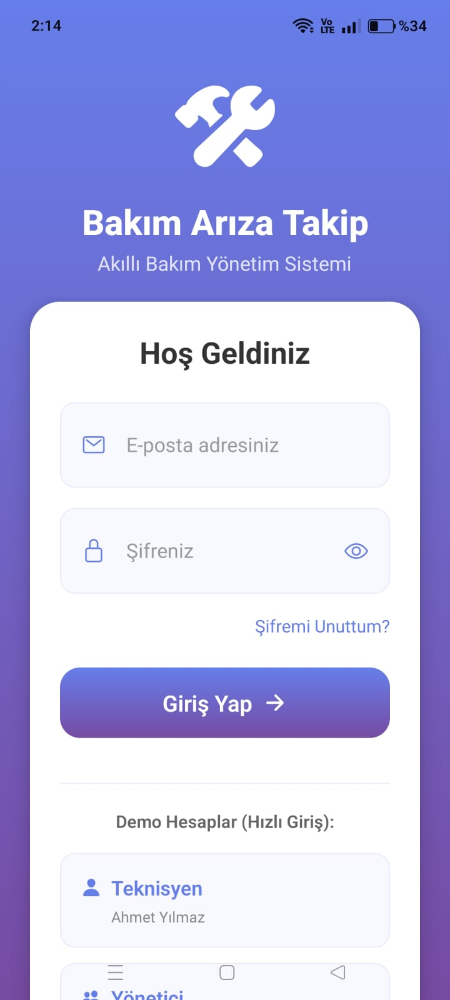
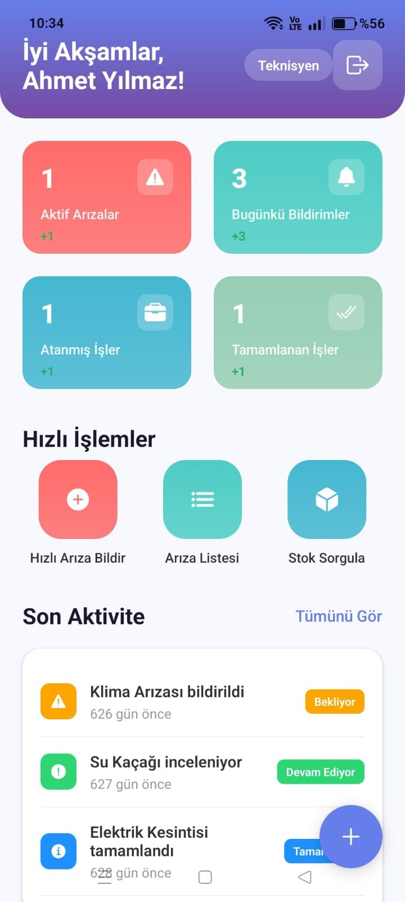
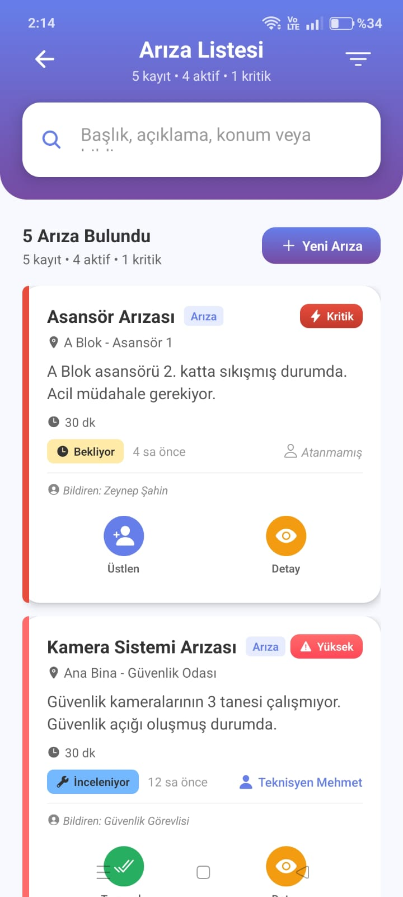
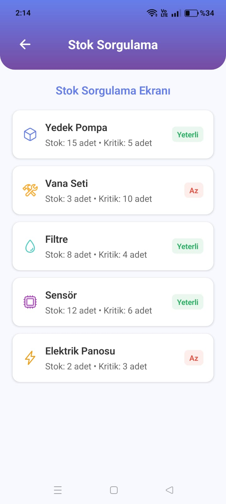
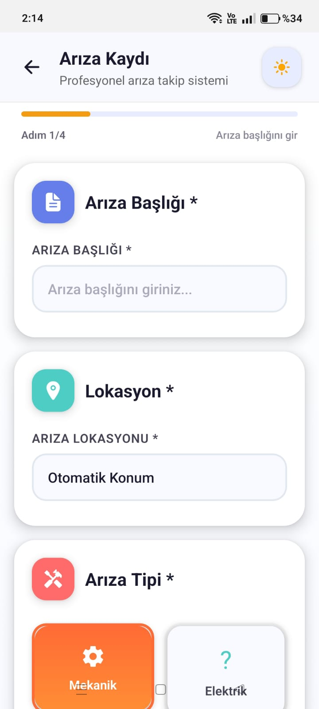

# Bakım Arıza Takip Uygulaması

Bu proje, bakım ve arıza kayıtlarını takip etmek için geliştirilmiş bir mobil uygulamadır.

## Özellikler
- ✅ Kullanıcı girişi ve kimlik doğrulama  
- ✅ Dashboard ile genel bakış  
- ✅ Arıza listesi görüntüleme  
- ✅ Arıza detayları inceleme  
- ✅ Kullanıcı profili yönetimi  
- ✅ Filtreleme ve arama özellikleri  

## Ekran Görüntüleri

| Giriş Ekranı | Dashboard | Arıza Listesi | Stok Sorgulama | Arıza Kaydı |
|---|---|---|---|---|
|  |  |  |  |  |

## Kurulum

1. Projeyi klonlayın:  
git clone https://github.com/MahirKaan/BakimArizaApp.git

2.Proje dizinine gidin:
cd BakimArizaApp

3.Gerekli paketleri yükleyin:
npm install

4.Uygulamayı başlatın:
npm start

